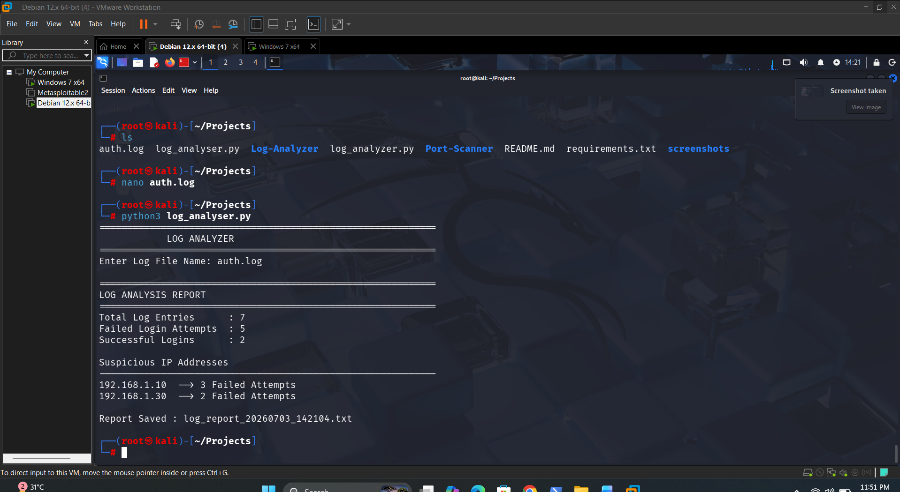

# Log Analyzer

A Python-based Log Analyzer that reads Linux authentication logs, detects failed and successful login attempts, identifies suspicious IP addresses, and generates automated timestamped security reports.

## Features

- Analyze Linux authentication logs
- Count failed login attempts
- Count successful login attempts
- Detect suspicious IP addresses
- Generate timestamped security reports
- Command-line interface

## Tech Stack

- Python
- Linux
- File Handling
- Log Analysis

## Installation

No external dependencies are required.

## Usage

```bash
python3 log_analyzer.py
```

Enter the log file name when prompted.

Example:

```text
Enter Log File Name: auth.log
```

## Example Output

```text
============================================================
LOG ANALYSIS REPORT
============================================================
Total Log Entries      : 7
Failed Login Attempts  : 5
Successful Logins      : 2

Suspicious IP Addresses
------------------------------------------------------------
192.168.1.10 --> 3 Failed Attempts
192.168.1.30 --> 2 Failed Attempts

Report Saved : log_report_20260703_142104.txt
```

## Screenshot



## Future Improvements

- Support multiple log formats
- Export reports in CSV format
- Severity-based log classification
- Email alert generation
- Real-time log monitoring
